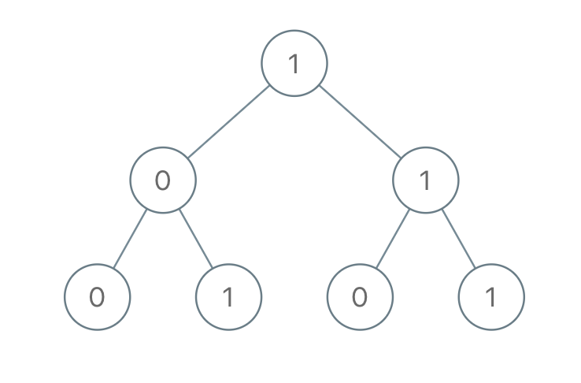

# 1022. Сумма двоичных чисел от корня до листа
Вам дан root бинарного дерева, в котором каждый узел имеет значение 0 или 1. Каждый путь от корня к листу представляет собой двоичное число, начинающееся с старшего бита.

Например, если путь указан как 0 -> 1 -> 1 -> 0 -> 1, то в двоичном виде он может выглядеть как 01101 и представлять собой 13.
Для всех листьев дерева рассмотрим числа, соответствующие пути от корня до этого листа. Верните сумму этих чисел.

Тестовые примеры составлены таким образом, чтобы ответ помещался в 32-битное целое число.   

Пример 1:

>Входные данные: root = [1,0,1,0,1,0,1]   
Выходные данные: 22   
Пояснение: (100) + (101) + (110) + (111) = 4 + 5 + 6 + 7 = 22

Пример 2:   
> Входные данные: root = [0]   
Выходные данные: 0
 

Ограничения:
* Количество узлов в дереве находится в диапазоне [1, 1000].
* Node.val равно 0 или 1.
 

